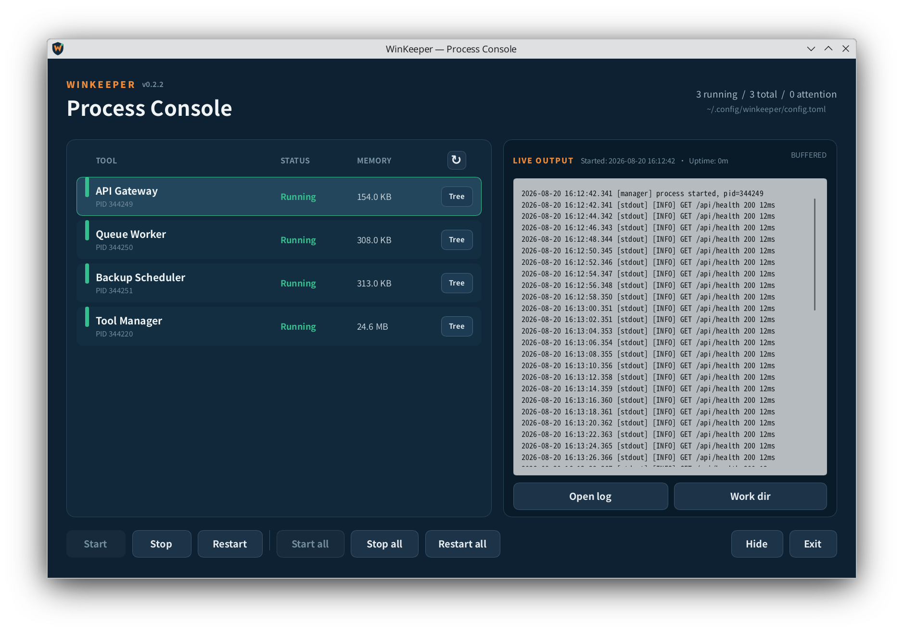

# WinKeeper

[简体中文](README.zh-CN.md)

WinKeeper is a lightweight cross-platform desktop process supervisor for managing persistent command-line tools. It provides tray management, lifecycle control, automatic restart, stdout/stderr collection, persistent logs, process-tree cleanup, and on-demand memory sampling.

## Screenshot



The screenshot is captured from the real application using representative sample processes and logs.

## Platforms

Release artifacts are produced for:

| Platform | Architecture | Process tree | Memory source | Autostart |
| --- | --- | --- | --- | --- |
| Windows 10/11 | x86_64, ARM64 | Job Object | Process-tree PrivateUsage | `HKCU\...\Run` |
| Linux Desktop | x86_64, ARM64 | Process Group | Process-tree `/proc/<pid>/smaps_rollup` PSS | XDG autostart |

Linux targets Debian/Ubuntu desktop environments, KDE Plasma and GNOME, on X11 or Wayland. macOS is not supported.

## Features

- Shared Slint manager UI and system tray on Windows and Linux
- Configuration-driven direct process execution without a shell
- Start, stop, restart, and batch actions
- stdout and stderr capture with timestamped per-tool logs
- Click-to-select live output with start time and uptime
- In-memory live log buffer and a dedicated manager log
- Automatic restart with delay and restart-window limiting
- Asynchronous process-tree inspection with Windows Job Objects and Linux systemd user scopes, with process groups as the descendant-cleanup fallback
- Process-tree memory sampling on demand and delayed sampling after startup or restart
- Native per-user autostart integration
- Per-user single-instance enforcement
- Minimized taskbar startup, tray controls, and close-to-tray behavior
- State-aware controls that disable unavailable actions
- Persistent elevated helper for administrator-designated tools on Windows

On Windows, `admin = true` tools are delegated to the persistent elevated helper. Linux Polkit integration is not currently provided, so Linux tools run with the WinKeeper user's privileges.

## Configuration

The default configuration paths are:

| Platform | Configuration | Logs |
| --- | --- | --- |
| Windows | `%APPDATA%\WinKeeper\config.toml` | `%APPDATA%\WinKeeper\logs` |
| Linux | `~/.config/winkeeper/config.toml` | `~/.local/state/winkeeper/logs` |

WinKeeper creates an empty valid configuration on first launch. Use [config.example.toml](config.example.toml) as a reference. The same TOML schema is used on both platforms.

```toml
[manager]
lang = "zh_CN"
start_with_system = true
minimize_to_tray = true
log_buffer_lines = 10000
log_buffer_bytes = 2097152
log_file_max_bytes = 10485760
log_line_max_bytes = 65536
stop_timeout_ms = 30000

[[tools]]
name = "worker"
command = "C:\\Tools\\worker.exe"
args = ["--config", "worker.toml"]
workdir = "C:\\Tools"
# Optional graceful stop hook; WINKEEPER_PID is set to the managed root PID.
# graceful_stop_command = "C:\\Tools\\example-worker-control.exe"
# graceful_stop_args = ["stop"]
admin = false
auto_start = true
auto_restart = true
restart_delay_ms = 3000
max_restart_count = 5
restart_window_seconds = 60
```

Set `manager.lang` to an English or Chinese locale such as `en`, `en_US`, `zh`, or `zh_CN` to override automatic language detection. Omit it to use the operating system language.

After changing `config.toml`, exit and restart WinKeeper. Settings opens the active configuration in the operating system's associated editor.

## Command line

```text
win-keeper [--config PATH] [--check-config] [--show] [--autostart]
```

Normal launches open the manager immediately. System autostart entries use the internal `--autostart` flag to start WinKeeper minimized in the taskbar when `minimize_to_tray` is enabled. Restore it from the taskbar or tray icon; `--show` explicitly opens it as well.

## Build

Rust 1.92 or newer is required by Slint 1.17.

```bash
cargo build --release --locked
```

Cross-compile Windows x86_64 from Linux with MinGW:

```bash
rustup target add x86_64-pc-windows-gnu
cargo build --release --locked --target x86_64-pc-windows-gnu
```

CI uses native GitHub runners for Windows x86_64/ARM64 and Linux x86_64/ARM64. Tagged builds package a single executable together with this README and the example configuration.

## Architecture

```text
src/core       platform-neutral config, logs, state machine, supervisor
src/platform   Windows Job/registry/memory and Linux process-group/XDG/proc adapters
ui             shared Slint manager and SystemTrayIcon
```

Core never calls Win32, Unix signals, or `/proc` directly. Platform differences implement shared lifecycle and memory semantics without leaking operating-system details into the UI.

## License

Apache-2.0. Slint is used under its applicable royalty-free/open-source licensing terms.
