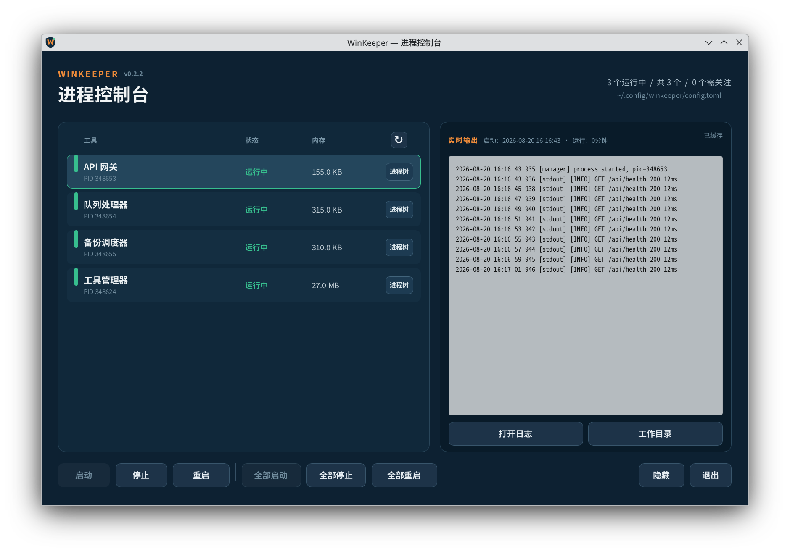

# WinKeeper

[English](README.md)

WinKeeper 是一个轻量级、跨平台的桌面进程守护工具，适合管理需要长期运行的命令行程序。它提供托盘管理、生命周期控制、自动重启、标准输出/错误输出采集、持久化日志、进程树清理以及按需内存采样。

## 界面预览



截图由真实程序窗口生成，画面中的进程与日志均为演示数据。

## 支持平台

发布制品覆盖：

| 平台 | 架构 | 进程树 | 内存来源 | 自动启动 |
| --- | --- | --- | --- | --- |
| Windows 10/11 | x86_64、ARM64 | Job Object | 进程树 PrivateUsage | `HKCU\...\Run` |
| Linux 桌面 | x86_64、ARM64 | Process Group | 进程树 `/proc/<pid>/smaps_rollup` PSS | XDG autostart |

Linux 面向 Debian/Ubuntu 桌面环境，支持 KDE Plasma 与 GNOME，以及 X11 和 Wayland。暂不支持 macOS。

## 功能

- Windows 与 Linux 共用的 Slint 管理界面和系统托盘
- 通过配置直接启动进程，不经过额外 Shell
- 单个或批量启动、停止和重启
- 带时间戳的 stdout/stderr 采集与按工具持久化日志
- 点击任务立即查看实时输出、启动时间和运行时长
- 内存中的实时日志缓冲与独立的工具管理器日志
- 支持延迟和重启窗口限制的自动重启
- 异步查看进程树；Windows 使用 Job Object，Linux 优先使用 systemd 用户 scope，并以 Process Group 兜底清理后代进程
- 按需统计进程树内存，并在首次启动和后续重启后延迟自动采样
- 当前用户级自动启动和单实例限制
- 自动启动时最小化到任务栏、托盘控制、关闭到托盘
- 根据任务状态自动禁用不可用操作
- Windows 管理员工具使用持久化提权助手

Windows 上，`admin = true` 的工具会交给持久化提权助手运行。Linux 暂未集成 Polkit，因此工具使用启动 WinKeeper 的用户权限运行。

## 配置

默认配置与日志路径：

| 平台 | 配置文件 | 日志目录 |
| --- | --- | --- |
| Windows | `%APPDATA%\WinKeeper\config.toml` | `%APPDATA%\WinKeeper\logs` |
| Linux | `~/.config/winkeeper/config.toml` | `~/.local/state/winkeeper/logs` |

WinKeeper 首次启动时会创建一个空的有效配置。完整示例见 [config.example.toml](config.example.toml)，Windows 与 Linux 使用同一套 TOML 结构。

```toml
[manager]
lang = "zh_CN"
start_with_system = true
minimize_to_tray = true
log_buffer_lines = 10000
log_buffer_bytes = 2097152
log_file_max_bytes = 10485760
log_line_max_bytes = 65536
stop_timeout_ms = 30000

[[tools]]
name = "worker"
command = "C:\\Tools\\worker.exe"
args = ["--config", "worker.toml"]
workdir = "C:\\Tools"
# 可选的优雅停止命令；执行时 WINKEEPER_PID 为受管根进程 PID
# graceful_stop_command = "C:\\Tools\\example-worker-control.exe"
# graceful_stop_args = ["stop"]
admin = false
auto_start = true
auto_restart = true
restart_delay_ms = 3000
max_restart_count = 5
restart_window_seconds = 60
```

`manager.lang` 可设置为 `en`、`en_US`、`zh`、`zh_CN` 等英文或中文区域标识，以覆盖系统语言自动检测；省略该字段则跟随操作系统语言。

修改 `config.toml` 后，请退出并重新启动 WinKeeper。点击界面右上角配置路径或托盘中的配置入口，会通过系统关联的编辑器打开当前配置文件。

## 命令行

```text
win-keeper [--config PATH] [--check-config] [--show] [--autostart]
```

普通启动会立即打开管理器。系统自动启动项使用内部参数 `--autostart`；启用 `minimize_to_tray` 时，WinKeeper 会以任务栏最小化状态启动，可从任务栏或托盘图标恢复。`--show` 会明确要求显示窗口。

## 构建

Slint 1.17 要求 Rust 1.92 或更高版本。

```bash
cargo build --release --locked
```

在 Linux 上使用 MinGW 交叉编译 Windows x86_64：

```bash
rustup target add x86_64-pc-windows-gnu
cargo build --release --locked --target x86_64-pc-windows-gnu
```

CI 使用原生 GitHub Runner 构建 Windows x86_64/ARM64 与 Linux x86_64/ARM64。标签构建会把单个可执行文件、README 和示例配置一起打包。

## 架构

```text
src/core       平台无关的配置、日志、状态机和进程监督器
src/platform   Windows Job/注册表/内存与 Linux systemd scope/进程组/XDG/proc 适配器
ui             共用的 Slint 管理器和 SystemTrayIcon
```

核心层不会直接调用 Win32、Unix 信号或 `/proc`。平台差异通过统一的生命周期和内存接口实现，不会泄漏到 UI 层。

## 许可证

Apache-2.0。Slint 按其适用的免版税/开源许可条款使用。
